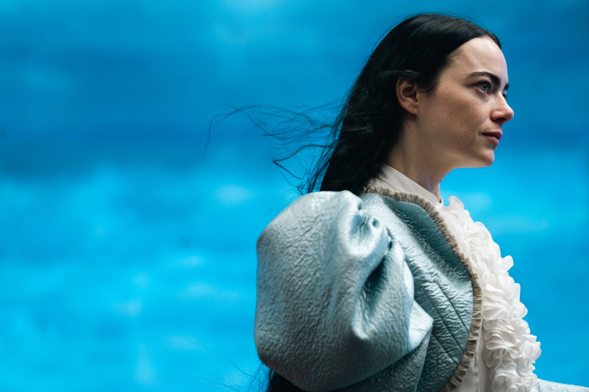
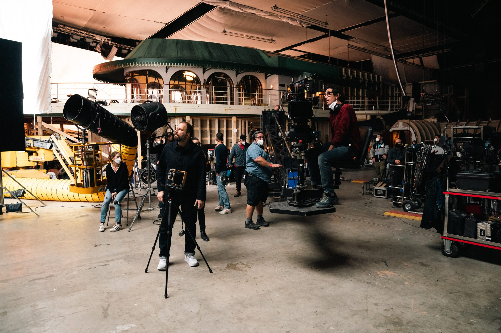

<!--
  이미지 안내(편집용):
  - [[이미지 N]] 위치에 라이선스 확보한 사진을 넣으세요.
  - 무단 스크랩 금지. 보도용(EPK)/게티/배급사 또는 작가 공식 채널 + 크레딧.
  - SSENSE 게재 이미지 크레딧 예: *Poor Things (2023). Photo by Atsushi Nishijima.
    Courtesy of Searchlight Pictures.*
-->

## 들어가며 — 있지만, 없는 사람

촬영장 한가운데, 은색 사다리 위에 올라선 한 사람이 있다. 스니커즈에 초록색
워크 재킷 차림의 요르고스 란티모스다. 그는 분주한 스태프들 너머 누군가와
눈을 맞추려 한다. 그가 찾는 건 한 사람의 렌즈 — **아츠시 니시지마**, 모두가
'**지마(Jima)**'라 부르는 사진가의 카메라다.

"현장에 있지만, 없는 사람처럼이에요." 지마는 자신의 존재를 그렇게 설명한다.
"그렇다고 완전히 사라지지도 않죠." 수년째 란티모스는 이 조용한 일본인
사진가를 불러, 자신의 영화가 만들어지는 과정을 기록하게 해 왔다. 『킬링
디어』, 『더 페이버릿』, 『가여운 것들』, 그리고 『카인즈 오브 카인드니스』까지.

*『가여운 것들』(2023). Photo by Atsushi Nishijima. Courtesy of Searchlight Pictures.*

## 시즈오카에서 뉴욕으로

지마는 일본 남동부의 해안 도시 시즈오카에서 태어났다. 10대 때 처음 미국을
찾았다가 그 거대한 스케일에 매료됐고, 브루클린 칼리지에 진학해 사진을
전공했다. 졸업 후에는 리처드 아베돈의 옛 어시스턴트가 세운 사진 랩
'실버웍스(SilverWorks)'에서 일했다. 어빙 펜, 스티븐 마이젤, 스티븐 클라인,
애니 레보비츠 같은 이름들이 그곳의 고객이었다. "그런 환경에서, 사진을 향한
매혹이 자라났어요." 그는 말한다.

첫 직업적 작업은 기업 다큐멘터리의 스틸이었다. 그중에는 나이키의 농구
영화도 있었다. "스포츠 사진은 보통 망원렌즈에 의존하지만, 젊고 의욕이
넘쳤던 저는 **가까이 다가가야 하는 필름 카메라**로 찍기로 했죠." 멀리서
당겨 찍는 대신, 피사체에 바싹 붙어 필름으로 담는다 — 훗날 그의 인장이 될
방식은 이때 이미 시작되고 있었다. 이후 데릭 시안프랜스의 『플레이스 비욘드
더 파인즈』에서 라이언 고슬링과 에바 멘데스를 찍으며 할리우드에 발을
들였고, 이냐리투·배리 젱킨스·에이바 듀버네이의 현장에도 그의 카메라가
함께했다.

*촬영 현장에서. Photo by Atsushi Nishijima.*

## 란티모스와 만나다

란티모스와의 인연은 우연히 시작됐다. 비행기 안에서 지마는 아무런 정보 없이
『더 랍스터』를 봤고, 바로 다음 날 감독의 프로듀서에게서 전화를 받았다.
『킬링 디어』 — 잔혹하고 어두운 복수의 동화 — 의 현장에 와 줄 수 있겠냐는
제안이었다.

*『카인즈 오브 카인드니스』(2024). Photo by Atsushi Nishijima. Courtesy of Searchlight Pictures.*

여러 작품을 함께한 지금, 둘의 관계는 우정에 가깝다. 란티모스는 지마가 사는
뉴욕에 올 때면 "점심 먹을래?" 같은 메시지를 보낸다. "점점 더 바빠지는데도
시간을 내요." 지마가 말한다. "사진이나 일 얘기만 하는 게 아니라, '이 옷
살까 하는데 어때?' '요즘 일본 가족이랑은 연락했어?' 같은 걸 물어요. 그런
걸 신경 쓰는 사람이죠." 오스카 후보에 오른 감독에게도, 옷차림을 봐 줄
눈 밝은 친구 하나쯤은 필요한 법이다.

*뉴욕에서 점심을 마친 뒤 포착한 요르고스 란티모스 (2018). Courtesy of Atsushi Nishijima.*

## 1~2미터의 관계

지마의 사진을 이해하는 열쇠는 '거리'다. 영문 기사의 제목이 그를 두고
'스타에게서 세 발짝 거리(Three Feet From Stardom)'라 부른 것은 과장이 아니다.

"저는 멀리서 찍기보다 피사체에서 1~2미터 안에서 찍는 걸 좋아해요." 그가
말한다. "촬영 사이 감독과 배우가 낮은 목소리로 이야기를 나눌 때가 어렵죠.
끼어들 수 없으니까요. 그 공간에 들어갈 수 있느냐, 그게 시험이에요. 어쩌면
일본 문화가 도움이 됐는지도 몰라요. 일본의 아파트에서 자라며, 부모님은
아랫집에 방해되지 않게 조용히 걸으라고 하셨거든요."

그 조심스러운 거리에서, 그는 영화가 만들어지는 '인간의 노동'을 놀랍도록
다정하게 붙잡는다. 『더 페이버릿』을 찍을 때의 일이다. "엠마 스톤이 촬영
사이 소파에 눈을 감고 누워 쉬고 있었어요. 조용히 다가갔는데, 그녀가 갑자기
눈을 떴고 — 저는 그 순간을 셔터로 담았죠. 엠마의 진짜 모습이 담겨 있어서,
제가 가장 좋아하는 사진 중 하나예요." 컷과 컷 사이, 배우가 잠시 자기 생각
속으로 물러나는 그 틈에서, 영화를 만드는 사람들의 숨은 얼굴이 드러난다.

*『더 페이버릿』(2018). Photo by Atsushi Nishijima. Courtesy of Searchlight Pictures.*

## 필름이라는 물질

이 거리의 감각은 매체로도 이어진다. 『가여운 것들』은 디지털이 아니라
실제 **35mm 필름**으로 촬영됐다. 촬영감독 로비 라이언은 첫 30분가량을 흑백
필름으로 시작해 점차 색을 입히고, 그중 상당 부분을 엑타크롬 리버설 필름
특유의, 비현실적으로 끓어오르는 색으로 물들였다. 매끈한 디지털 대신 입자와
질감을 택한 세계 — 이 영화의 초현실은 '필름이라는 물질' 위에서 비로소 꿈처럼
보인다.

*『가여운 것들』(2023). Photo by Atsushi Nishijima. Courtesy of Searchlight Pictures.*

그 곁에서 지마가 든 카메라 역시 필름이었다. 촬영장의 비하인드 사진 속 그는
중형 포맷 필름 카메라 **플라우벨 마키나 67(Plaubel Makina 67)**을 눈가에 댄
채 셔터를 누른다. 6×7 판형에 80mm 단렌즈 하나, 한 롤에 열 장 남짓만 담기는
접이식 레인지파인더다. 마키나만 쓰는 것도 아니다 — 그는 여러 필름 카메라를
바꿔 들며, 무한히 셔터를 누를 수 있는 디지털 대신 **한 장 한 장에 더
신중해지는** 쪽을 택한다. 감독이 필름으로 영화를 찍는 동안, 그 곁의 사진가
또한 필름 위에 그 순간을 새겼다.

*『가여운 것들』(2023). Photo by Atsushi Nishijima. Courtesy of Searchlight Pictures.*

## 마술의 트릭을 드러내기

란티모스의 영화는 인간의 가장 밑바닥에 있는 욕망과 공포를 무표정하게
들여다본다. 그 화면 위의 이야기가 있다면, 그 이미지를 만들어 내는 '사람의
노동'이 따로 있다. 지마가 붙잡는 것은 후자다.

가령 이런 한 장. 『가여운 것들』 촬영 중, 란티모스가 원양 여객선 갑판에
앉아 자신의 주연 엠마 스톤의 이야기를 듣고 있다. 가운을 입은 그녀는 옆모습
만 보이지만 입가엔 옅은 미소가 걸려 있고, 작업복(또 스니커즈) 차림의 감독은
그녀를 올려다본다. 나무 갑판 위로는 전선이 뱀처럼 기어간다. 마술의 트릭을
드러내 보이는 사진이다. 하지만 그것은 환상을 깨뜨리는 대신, **그 환상을
가능케 한 진짜 협업**을 보여준다.

*『가여운 것들』(2023). Photo by Atsushi Nishijima. Courtesy of Searchlight Pictures.*

어쩌면 그 협업의 본질은 음식처럼 사소한 데 있는지도 모른다. 『카인즈 오브
카인드니스』를 찍던 뉴올리언스에서, 지마와 란티모스는 단골이 된 베트남
식당을 발견했다. "요르고스와 반미를 사서 같이 먹었어요. 어쩌면 그게 제겐
1~2미터의 관계인 거죠."

## 더 보기

<!-- 발행 시 아래 이미지들은 그리드 갤러리로 묶어도 좋음 -->

*『가여운 것들』(2023). Photo by Atsushi Nishijima. Courtesy of Searchlight Pictures.*

*『가여운 것들』(2023). Photo by Atsushi Nishijima. Courtesy of Searchlight Pictures.*

*『가여운 것들』(2023). Photo by Atsushi Nishijima. Courtesy of Searchlight Pictures.*

## 나가며

영화가 막을 내리면 움직임은 사라진다. 남는 것은 기억, 그리고 한 장의
사진이다. 우리가 『가여운 것들』을 떠올릴 때 머릿속에 멈춰 서는 그 이미지들은,
한 감독의 상상과, 그에게서 1~2미터 떨어진 자리에서 조용히 셔터를 누른 한
사진가의 눈이 10년 동안 맞춰 온 호흡의 결과다.

감독이 세계를 짓는다면, 곁의 사진가는 그 세계의 가장 정직한 한 장을 건져
올린다. 있지만 없는 사람처럼, 그러나 결코 완전히 사라지지 않는 자리에서.

---

### 편집용 메모 (공개 전 삭제)

- 1차 출처: **SSENSE, "Atsushi Nishijima Is Three Feet From Stardom"**
  (글 Reiko Suga, 2024-06-20). 본문 인용·일화·약력 대부분 이 기사 근거.
- 니시지마의 카메라 = **플라우벨 마키나 67 등 필름 카메라**: 출처는
  **인스타그램의 현장 비하인드 사진**(SSENSE엔 기종 언급 없음). 마키나 외에도
  여러 필름 카메라 사용 → 특정 기종 단정보다 폭넓게 서술.
- 『가여운 것들』 촬영감독 = **로비 라이언**. 35mm·첫 30분 흑백·엑타크롬
  리버설(약 30%)은 아래 시네마토그래피 출처 근거.
- 인용은 한국어로 의역함 — 공개 전 SSENSE 원문과 대조해 뉘앙스 확인 권장.
- 이미지 11컷 배치됨(content/articles/images/). ⚠️ **모두 © Atsushi Nishijima /
  Searchlight Pictures(또는 작가 본인)**. **공개 전 반드시 라이선스/사용허가
  확보 후 사용**. 크레딧 형식: "Photo by Atsushi Nishijima. Courtesy of
  Searchlight Pictures."
- ⚠️ 일부 이미지의 정확한 작품명(『가여운 것들』/『더 페이버릿』/『카인즈 오브
  카인드니스』)·연도는 시각 추정 — 공개 전 원본 캡션과 대조해 확정할 것.
  특히 on-set.jpg(현장 비하인드)는 작품·촬영자 확인 필요.
- 받은 19컷 중 11컷 사용. 나머지로 교체/추가 가능.

### 출처

- SSENSE — "Atsushi Nishijima Is Three Feet From Stardom" (Reiko Suga, 2024):
  https://www.ssense.com/en-us/editorial/culture/atsushi-nishijima-interview-yorgos-lanthimos-photographer
- JIMA(아츠시 니시지마 공식): https://www.jimagraphy.com/
- IMDb — Atsushi Nishijima: https://www.imdb.com/name/nm2041944/
- Screen Daily — Robbie Ryan on 『Poor Things』(필름/룩):
  https://www.screendaily.com/features/cinematographer-robbie-ryan-on-bending-the-rules-for-poor-things-its-not-meant-to-be-a-realistic-look/5189260.article
- AwardsWatch — Robbie Ryan, 엑타크롬 인터뷰:
  https://awardswatch.com/interview-cinematographer-robbie-ryan-on-using-ektachrome-to-shoot-poor-things-and-the-happy-accident-that-made-for-a-perfect-shot/
